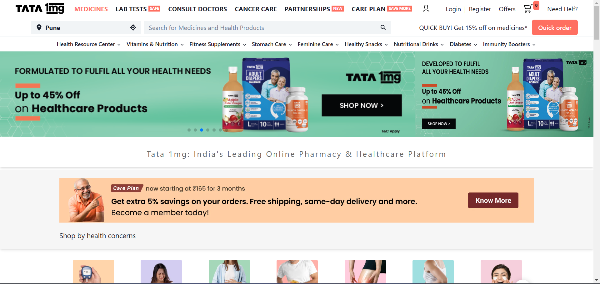
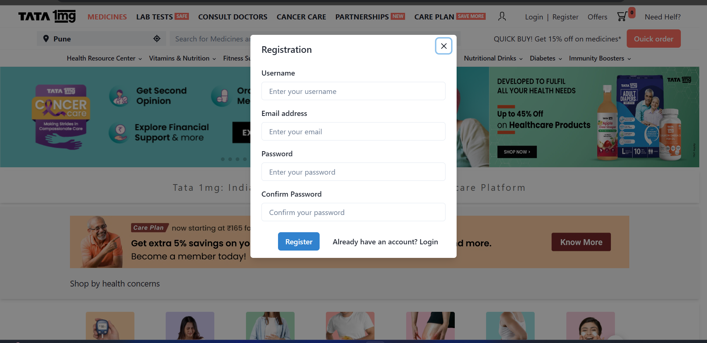
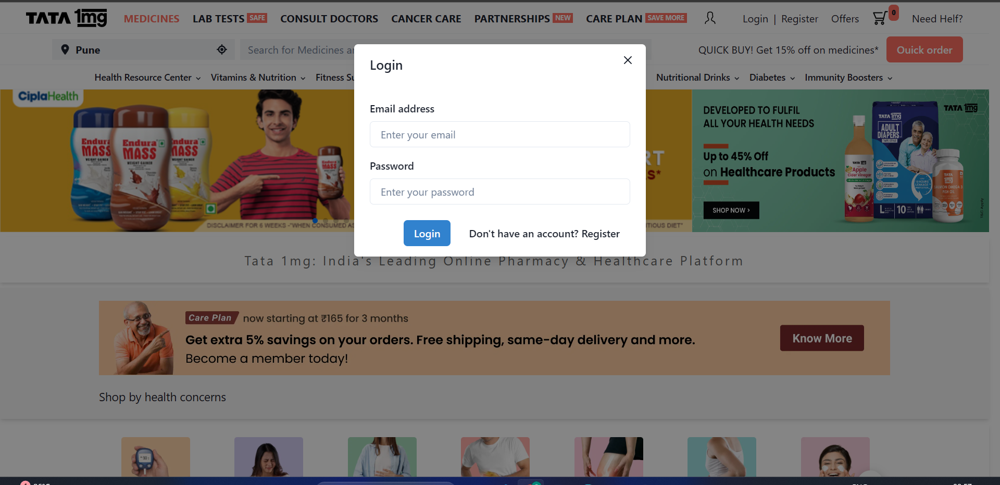
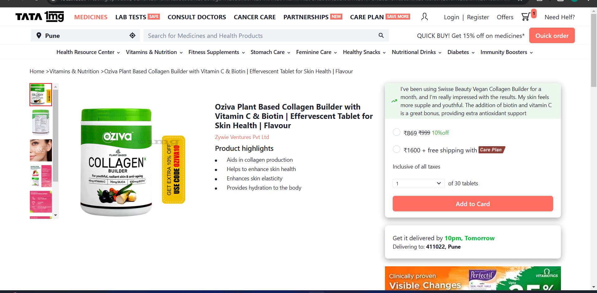
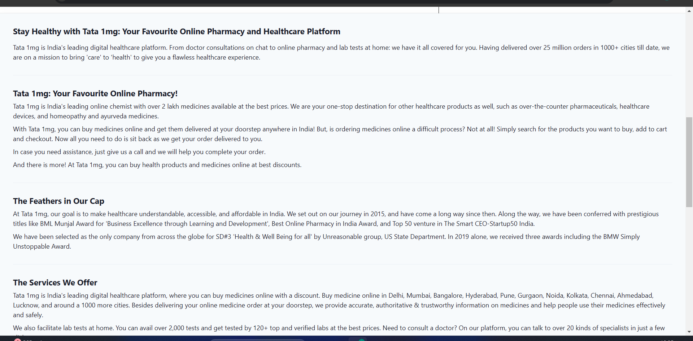
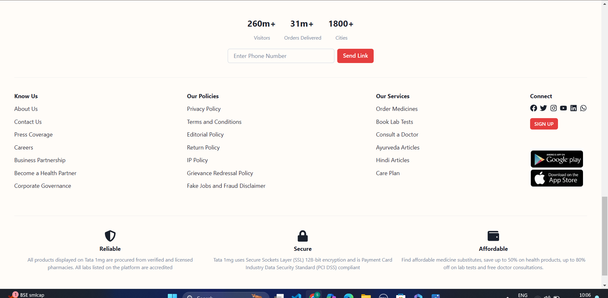

# 1mg.com

Tata 1mg is a leading digital health platform in India, offering online pharmacy services, diagnostic tests, and teleconsultations. Launched in 2015, it provides a wide range of prescription medicines, over-the-counter drugs, and healthcare products with home delivery. Users can book diagnostic tests with home sample collection and consult certified doctors online. The platform also offers health tools, extensive health content, and alternative medicines like Ayurveda and homeopathy. Tata 1mg aims to make healthcare accessible and affordable across India, bringing essential services directly to users through its website and app.

 ## Tech Stacks

 - HTML
 - CSS
 - JavaScript
 - React
 - Redux
 - Chakra ui
 - Node
 - Express js
 - MongoDB
 

## Tools

 - Vs Code
 - Git

## Functionalities
- Home page with a slider
- Navigation bar contains a mega menu which shows a list of
categories.
- Total number of items added by a user can be easily seen in
the home, product, and cart page.
- User can delete a single item or all the items.
- User can search item directly from database
- Google Sign in option 

    
## Project Screenshots

## Home Page

## Register Page

## Login Page

## Product Page

## Single Product Page

## Cart Page

## Footer

